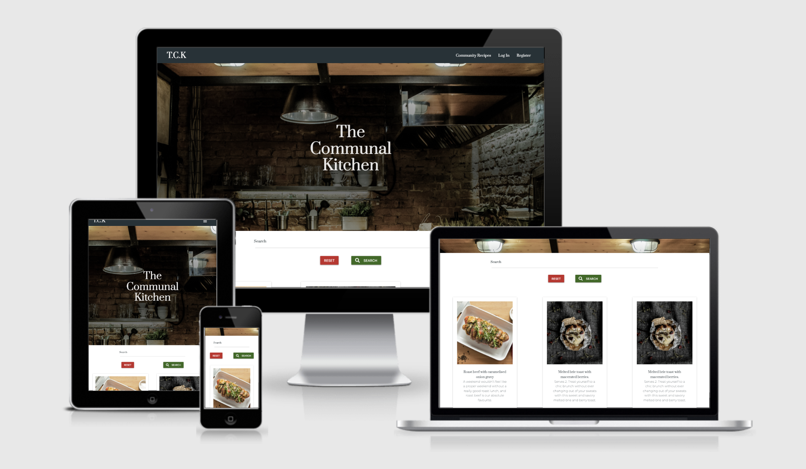
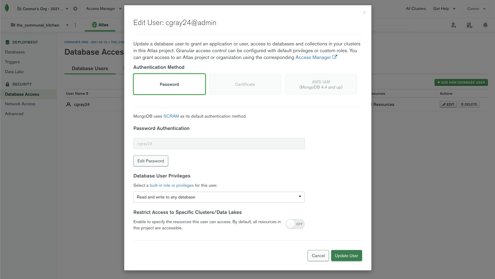
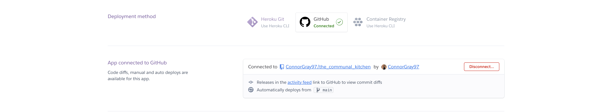
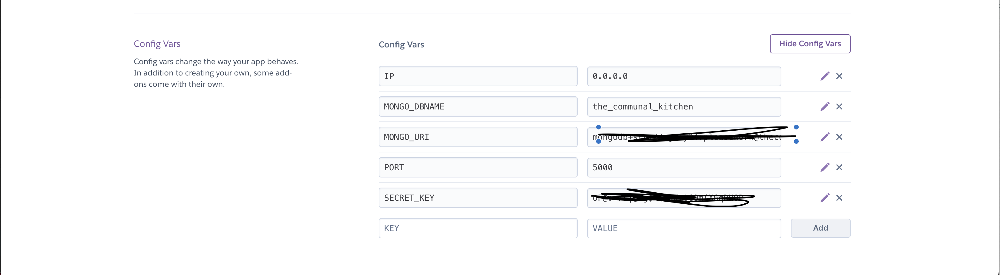

# The Communal Kitchen


[View the live site here](https://the-communal-kitchen.herokuapp.com/)


# User experience (ux)

## User stories:

### First time user:

As a first time user i want to:

- Understand the use of the site and what it is about.
- Register an account
- View recipies other people posted
- Open recipe cards to reveal the full recipe and steps
- Be able to search recipes by ingredient and recipe name.


### Recurring user:

- Log back into my pre registered account
- Add my own recipies using an intuitive form.
- Once recipes have been added be able to make updates to my pre exisiting recipes
- Delete my own recipies.

## Design

### Color scheme 


## Wireframes

### Desktop


### Mobile


# Technologies Used

### Languages Used

-   [HTML5](https://en.wikipedia.org/wiki/HTML5)
    - HTML5 was used to structure the site.
-   [CSS3](https://en.wikipedia.org/wiki/Cascading_Style_Sheets)
    - CSS3 was used for responsive design and html styling.
-   [Javascript](https://nl.wikipedia.org/wiki/JavaScript)
    - Javascript was used to append form lines and initialize materialize fucntions
-   [Python](https://www.python.org/)
    - Python was used to connect to the site to the Mongo.db site and to render templates throughout the site.
-   [Jinja](https://jinja.palletsprojects.com/en/3.0.x/)
    - Template code was written using Jinja.


### Frameworks, Libraries & Programs Used

1. [Materialize css 0.100.2:](http://archives.materializecss.com/0.100.2/getting-started.html)
    - Materialize was used throughout the project for quick construction of forms, dropdowns, responsivity and layout.
1. [Flask:](https://flask.palletsprojects.com/en/2.0.x/)
    - Used to render templates throughout the app.py.
1. [Google Fonts:](https://fonts.google.com/)
    - Google fonts was used with materialize to import them.
1. [jQuery:](https://jquery.com/)
    - jQuery Used among other things in script file to initialze materialize scripts.
1. [dbdiagram](https://dbdiagram.io/)
    - To design the database schema.
1. [Git](https://git-scm.com/)
    - Git was used for version control by utilizing the terminal.
1. [GitHub:](https://github.com/)
    - GitHub is used to store the projects code and assets and to fork the project.
1. [Adobe XD:](https://www.adobe.com/)
    - Adobe XD was used to create the mockups.
1. [Werkzeug](https://werkzeug.palletsprojects.com/en/2.0.x/)
    - To encrypt the users passwords.
1. [MongoDB:](https://www.mongodb.com/)
    - MongoDB was used to create the Database of users and recipes.
1. [Heroku:](https://www.heroku.com)
    - Heroku was used to deploy the app.
1. [Jpeg Optimizer](http://jpeg-optimizer.com/)
    - Jpeg Optimizer was used to compress the hero image to usable size.
1. [dbdiagram](https://dbdiagram.io/)
    - To design the database schema.

# Deployment and cloning

### Clone this repository:
### In linux:
To find the link, go to the "code" dropdown menu in this repository.
Click the clipboard icon next to the url.
In your terminal type:

```
$mkdir <jour project directory>
$git init <jour project directory> (to set up a new repository)
$git clone https://github.com/JorisPaarde/my-vegan-recipes.git
```

In Windows:

follow [these](https://www.jcchouinard.com/clone-github-repository-on-windows/) steps.

Install all requirements through the requirements.txt file:
```
pip install -r requirements.txt
```

### Create your account for MongoDB here: https://account.mongodb.com/account/register

When u are logged in:

- Go to clusters and click create database.

- Enter your database name.

- As your first collection name enter users.

- Click the plus sign next to your new database name to add the collections recipes and categories.

- Insert the categories documents as shown in the [database design](#database-in-mongo-db)

Documents for users and recipes can then be added trough the site or directly in mongo db as shown in the database design.

Your database is now ready for use.

### Create your env.py file:
```
$touch env.py
```

Make sure u add this env.py file to your gitignore file!
Add the folowing code to your env.py file:

```python
import os

os.environ.setdefault("IP", "0.0.0.0")
os.environ.setdefault("PORT", "5000")
os.environ.setdefault("SECRET_KEY", "<YOUR-SECRET-KEY-HERE>")
os.environ.setdefault("MONGO_URI", "mongodb+srv://root:<MONODBPASSWORD>@cluster0.ajvr3.mongodb.net/<DATABASENAME>?retryWrites=true&w=majority")
os.environ.setdefault("MONGO_DBNAME", "<DATABASENAME>")
```
Replace YOUR-SECRET-KEY-HERE, MONGODBPASSWORD, DATABASENAME according to your personal situation.

### To retrieve your mongodb pasword: 

Go to database access, click edit and show password:



Your local clone is now ready for use.

## To deploy this project on Heroku: 

- Create your account on Heroku here: https://signup.heroku.com/login

- Create a new app on heroku:

- Go to: https://dashboard.heroku.com/apps
select new, create new app from the dropdown menu on the right.
Enter your app-name and region and click create app.
Under delpoyment method, select github.



- Select your repository and connect.

- Go to settings, config vars and enter the variables also located in your env.py file.



- Go to deploy and at the bottom of the page manually deploy your main github branch

Your app is now deployed and ready to run.
At the top of the page click open app to run it.