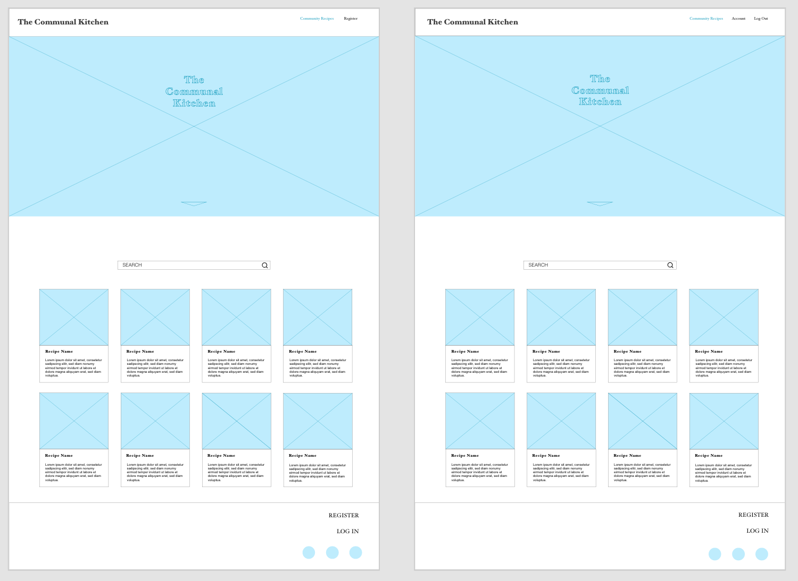
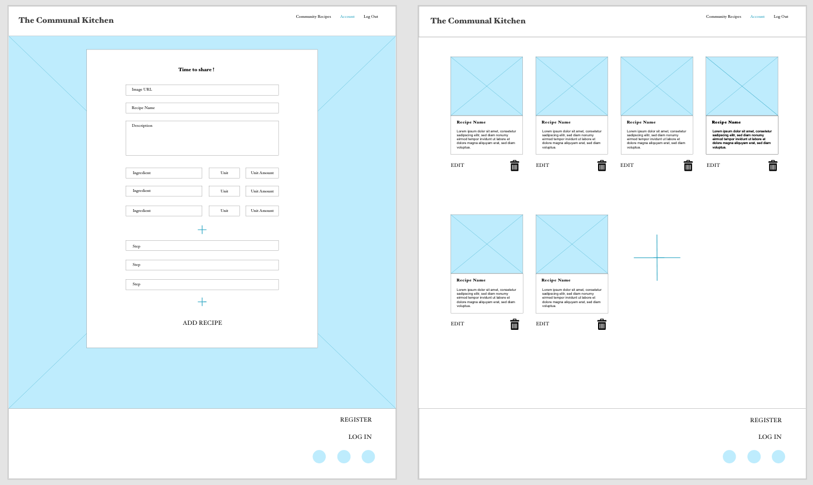
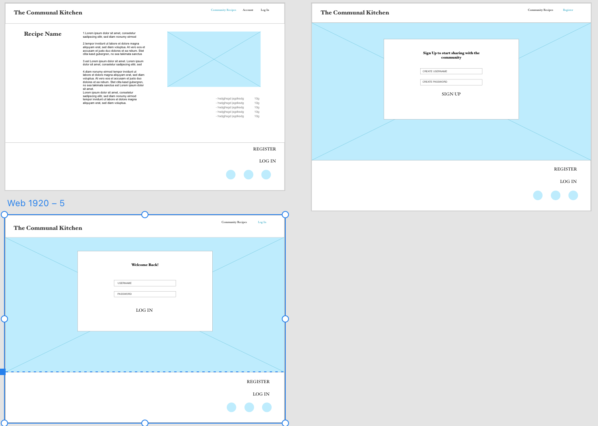
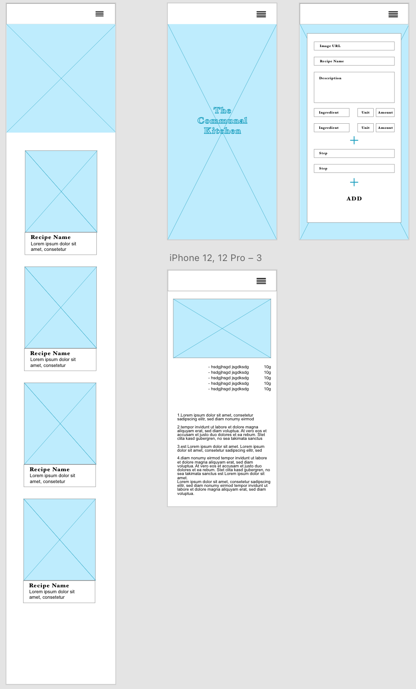

## Wireframes

### Desktop

### Mobile

# Technologies Used

### Languages Used

-   [HTML5](https://en.wikipedia.org/wiki/HTML5)
    - HTML5 was used to structure the site.
-   [CSS3](https://en.wikipedia.org/wiki/Cascading_Style_Sheets)
    - CSS3 was used for responsive design and html styling.
-   [Javascript](https://nl.wikipedia.org/wiki/JavaScript)
    - Javascript was used to append form lines and initialize materialize fucntions
-   [Python](https://www.python.org/)
    - Python was used to connect to the site to the Mongo.db site and to render templates throughout the site.
-   [Jinja](https://jinja.palletsprojects.com/en/3.0.x/)
    - Template code was written using Jinja.

### Frameworks, Libraries & Programs Used

1. [Materialize css 0.100.2:](http://archives.materializecss.com/0.100.2/getting-started.html)
    - Materialize was used throughout the project for quick construction of forms, dropdowns, responsivity and layout.
1. [Flask:](https://flask.palletsprojects.com/en/2.0.x/)
    - Used to render templates throughout the app.py.
1. [Google Fonts:](https://fonts.google.com/)
    - Google fonts was used with materialize to import them.
1. [jQuery:](https://jquery.com/)
    - jQuery Used among other things in script file to initialze materialize scripts.
1. [dbdiagram](https://dbdiagram.io/)
    - To design the database schema.
1. [Git](https://git-scm.com/)
    - Git was used for version control by utilizing the terminal.
1. [GitHub:](https://github.com/)
    - GitHub is used to store the projects code and assets and to fork the project.
1. [Adobe XD:](https://www.adobe.com/)
    - Adobe XD was used to create the mockups.
1. [Werkzeug](https://werkzeug.palletsprojects.com/en/2.0.x/)
    - To encrypt the users passwords.
1. [MongoDB:](https://www.mongodb.com/)
    - MongoDB was used to create the Database of users and recipes.
1. [Heroku:](https://www.heroku.com)
    - Heroku was used to deploy the app.
1. [Jpeg Optimizer](http://jpeg-optimizer.com/)
    - Jpeg Optimizer was used to compress the hero image to usable size.
1. [dbdiagram](https://dbdiagram.io/)
    - To design the database schema.
