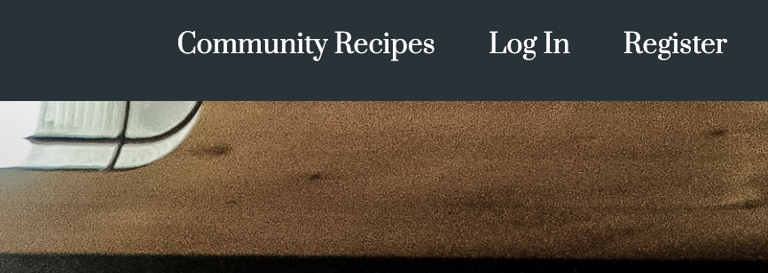
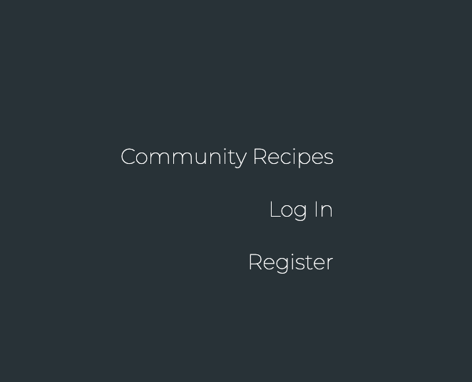
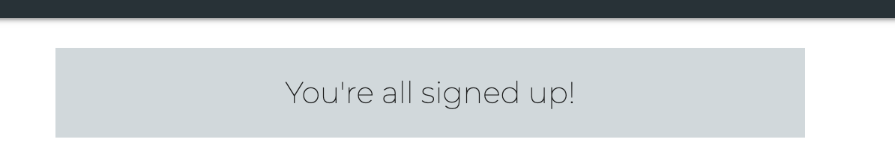
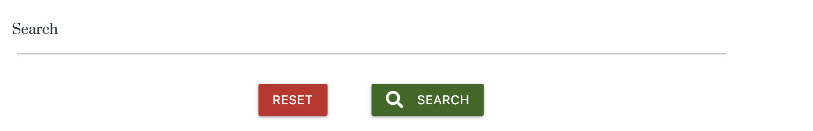
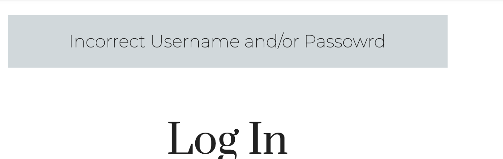
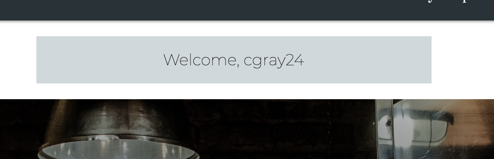
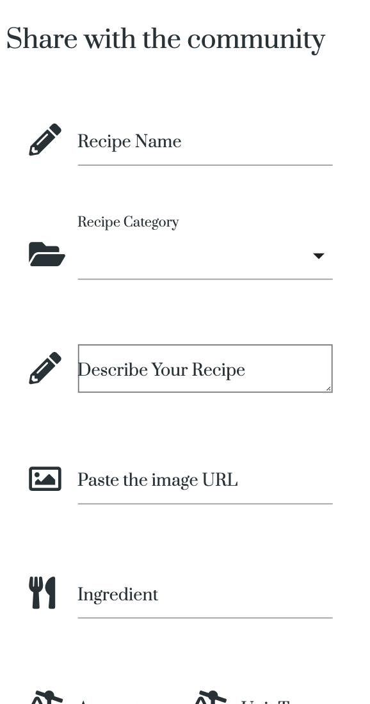
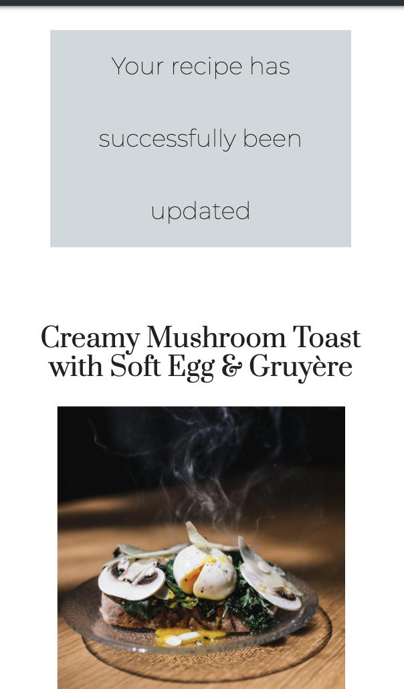

# Testing User Stories

## First time user:
### Understand the use of the site and what it is about. 
- User is greeted with large image appropriately chosen for the site topic with large H1  title of the site name.

### Register an account

-  User has the option to register from numerous links through out the site. On the homepages header and footer and also on the login and register forms. The user is also informed with flash messages notifying them that registration was successful.

### View recipies other people posted

- This can be done by viewing the community recipes link in the nav on both the footer and the header and can be viewed if you are registered or not. The recipes are displayed in cards withe the title and a brief description.

### Open recipe cards to reveal the full recipe and steps

- This can be done by clicking on the desired recipe card to reveal all instructions

### Be able to search recipes by ingredient and recipe name.

- This can be done on the community recipes page using the search bar locates underneath the hero image. The search can also be reset to original layout.

## Returning user:

### Log back into my pre registered account
- This can be done by following the log in link. A flash message appears to inform user of successfull login. If the details are incorrect a flash message appears informing the user that some details are wrong.

### Add my own recipies using an intuitive form.
- The add recipe form link only appears when the user is logged in. The form is easy to use and has been tested on multiple browsers and screen sizes.

### Once recipes have been added be able to make updates to my pre exisiting recipes.

- When on My Recipes page, on each recipe card there is a pencil icon. When user clicks on it the user is redirected to the same form but with the existing details that can then be updated and saved as desired. Once the updated form is submitted the user is redirected to the recipe they just made changes to.

# Validators

## To validate the html and CSS [W3C markup validation](https://validator.w3.org/) was used.
### base.html 
This threw up 35 errors due to the Jinja language tags in the HTML. This was to be expected. No other errors besides that.

 

### base.html

No issues besides the expected Jinja errors.

 

### login.html

No issues besides the expected Jinja errors.

 

### register.html

No issues besides the expected Jinja errors.

 

### profile.html

Pulled an error saying the anchor tags violated a nesting rule.

 

### recipes.html

No issues besides the expected Jinja errors.

 

### add_recips.html

No issues besides the expected Jinja errors.

 

### edit_recipe.html

No issues besides the expected Jinja errors.

 

### open_recipe.html

No issues besides the expected Jinja errors.

 

## For python validation [pep8online](http://pep8online.com/) was used.

# Browser testing

Browser|layout correct|functionality correct|Issues
---|---|---|---
Opera|Yes|Yes|None
Chrome|Yes|Yes|None
Edge|Yes|Yes|None
Firefox|Yes|Yes|None
