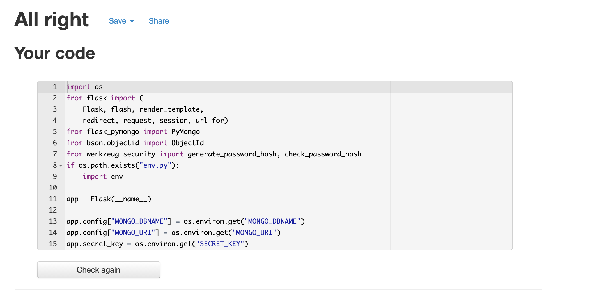

# Validators

## To validate the html and CSS [W3C markup validation](https://validator.w3.org/) was used.
### base.html 
This threw up 35 errors due to the Jinja language tags in the HTML. This was to be expected. No other errors besides that.

 

### base.html

No issues besides the expected Jinja errors.

 

### login.html

No issues besides the expected Jinja errors.

 

### register.html

No issues besides the expected Jinja errors.

 

### profile.html

Pulled an error saying the anchor tags violated a nesting rule.

 

### recipes.html

No issues besides the expected Jinja errors.

 

### add_recips.html

No issues besides the expected Jinja errors.

 

### edit_recipe.html

No issues besides the expected Jinja errors.

 

### open_recipe.html

No issues besides the expected Jinja errors.

 

## For python validation [pep8online](http://pep8online.com/) was used.

# Browser testing

Browser|layout correct|functionality correct|Issues
---|---|---|---
Opera|Yes|Yes|None
Chrome|Yes|Yes|None
Edge|Yes|Yes|None
Firefox|Yes|Yes|None
